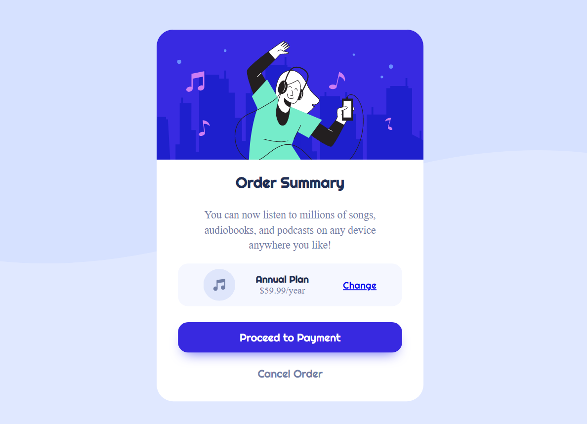

# Frontend Mentor - Order summary card solution

This is a solution to the [Order summary card challenge on Frontend Mentor](https://www.frontendmentor.io/challenges/order-summary-component-QlPmajDUj). Frontend Mentor challenges help you improve your coding skills by building realistic projects.

## Table of contents

- [Overview](#overview)
  - [The challenge](#the-challenge)
  - [Screenshot](#screenshot)
  - [Links](#links)
- [My process](#my-process)
  - [Built with](#built-with)
  - [Continued development](#continued-development)
- [Author](#author)

## Overview

### The challenge

- The challenge is to build a order summary card component
- The card component is responsive for mobile and desktop devices

### Screenshot

### Links

- Solution URL: [Project Code](https://github.com/alancrisanto/frontmentor/tree/master/order-summary-component-main)
- Live Site URL: [Project Live Site](https://alancrisanto.github.io/frontmentor/order-summary-component-main/index.html)

## My process

### Built with

- Semantic HTML5 markup
- CSS custom properties
- Flexbox
- Mobile-first workflow

### Continued development

I'm continuing on my pathway to improve my design skills and performance building frontend projects, I enjoy programming and creating excellent website applications.

## Author

- Website - [My Portfolio](https://alancrisanto.github.io/Portfolio/)
- LinkedIn - [LinkedIn Profile](https://www.linkedin.com/in/alancrisanto/)
- Frontend Mentor - [Frontendmentor Profile](https://www.frontendmentor.io/profile/alancrisanto)
